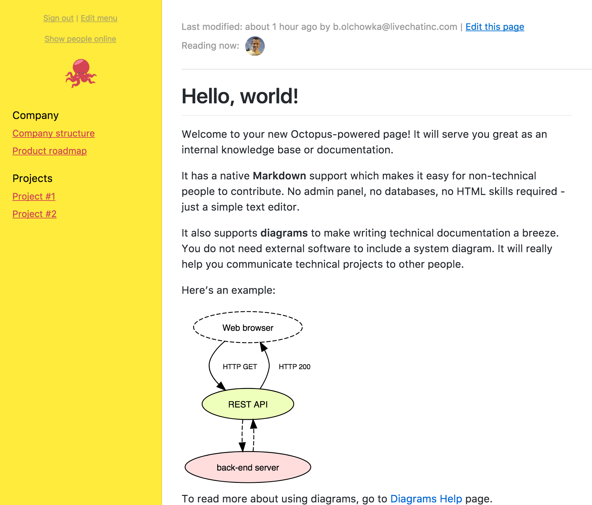
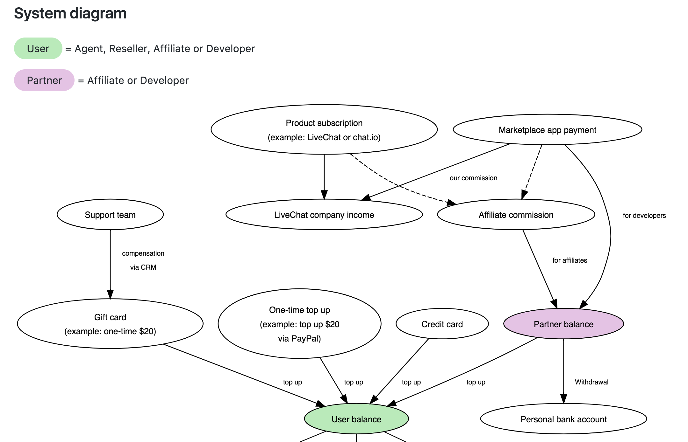
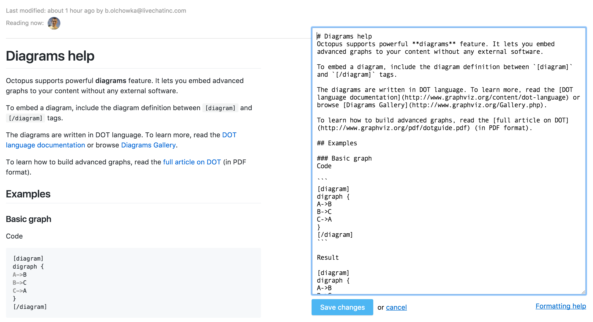
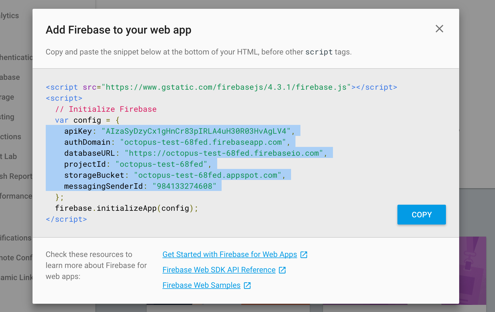
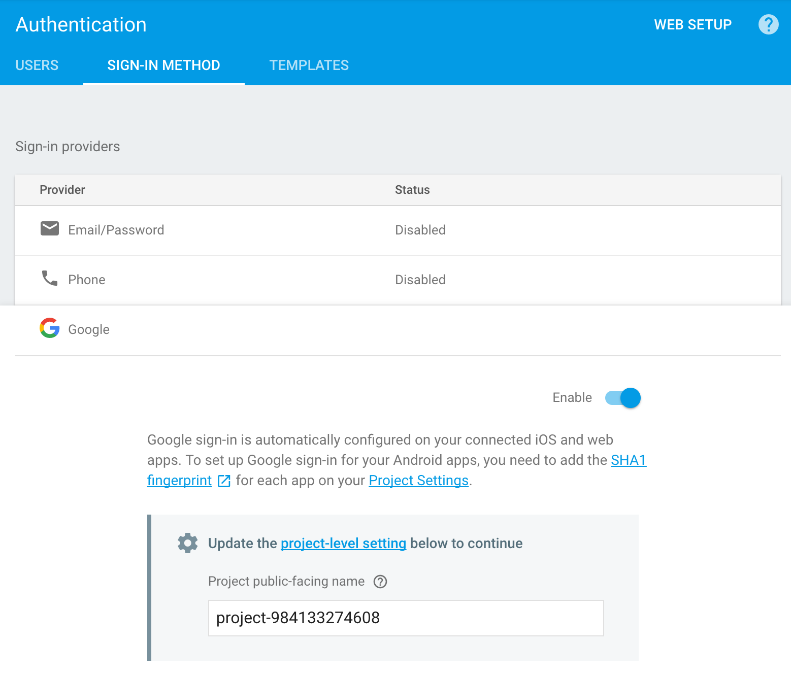
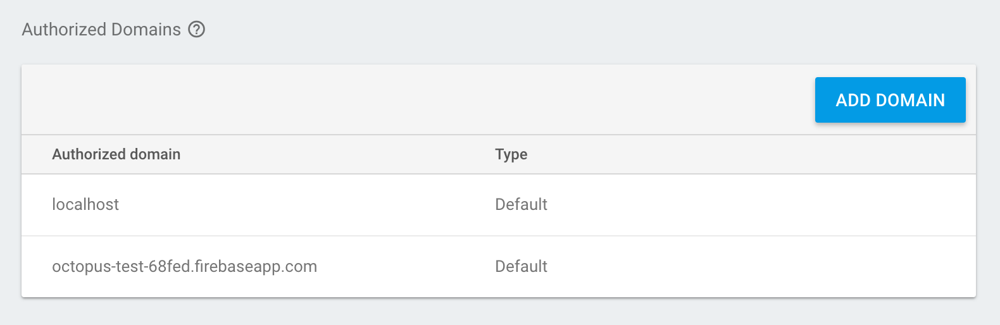
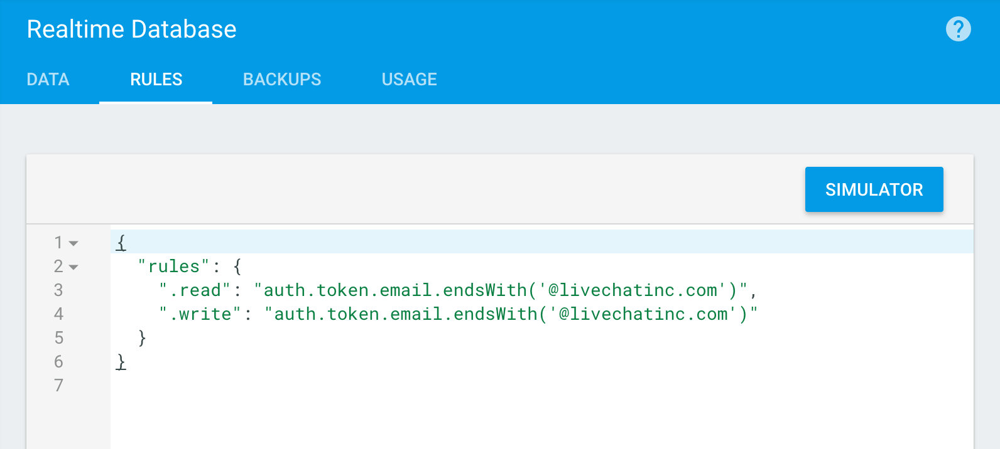
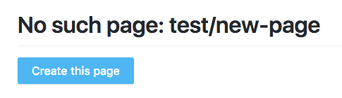
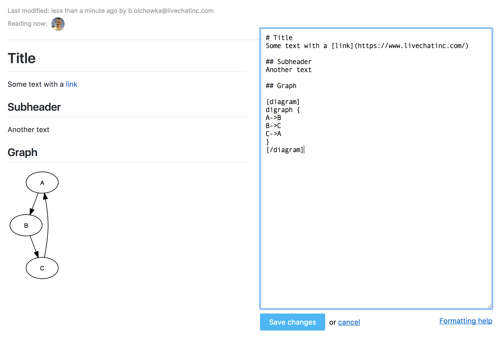
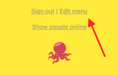

# Octopus

[](https://github.com/prettier/prettier)

**🐙 Octopus** is a server-less, easy-to-setup internal wiki page with built-in software diagrams support. It uses **Markdown** for writing content and enhances it with [Graphviz](http://graphviz.org) and [flowchart.js](http://flowchart.js.org/) diagrams for easy software documentation.

Here's a default wiki page:

<kbd>
  
</kbd>

### Technology

Octopus is a [JAMstack](https://jamstack.org/) app that uses [Google Firebase](https://firebase.google.com/) as its backend. You do not need a web server (such as Apache) or a database (like MySQL) to have it up and running. You can deploy the app to a CDN for free using [Netlify](https://www.netlify.com/).

#### With Octopus, you can:
* require users to be signed in to read or edit the wiki (supported providers: Google, GitHub, Email/Password, Twitter and Phone),
* create access rules for reading and editing (restrict particular users or auth domains),
* host wiki page under a custom domain.

#### Features
* create new wiki pages with Markdown language,
* edit menu (using Markdown) to easily link to wiki pages,
* include [Graphviz](http://www.graphviz.org/Gallery.php) and [flowchart.js](http://flowchart.js.org/) diagrams inside your Markdown content,
* see who is currently reading your wiki articles,
* adjust your Wiki front-end with React ([create-react-app](https://github.com/facebookincubator/create-react-app)).


#### Example system diagram
<kbd>
  
</kbd>

#### Page editing with Markdown
<kbd>
  
</kbd>

## Installation
1. Clone this repository to your computer.
2. Copy config template file (`src/config/config.template.js`) to `src/config/config.js`.

```
cp src/config/config.template.js src/config/config.js
```

> Note: you can safely commit `src/config/config.js` file to a repository. This file does not store sensitive credentials - all config variables will be publicly available in the `.js` file anyway.

3. Create a new Firebase project here: https://firebase.google.com/
4. Pick "Add Firebase to your web app" and copy the config to `src/config/config.js` created in step 2.

<kbd>
  
</kbd>
<br /><br />

5. In Firebase Console, go to **Authentication** > **Sign-in method**, choose a provider and enable it. Octopus has been tested with Google and GitHub providers.
<kbd>
  
</kbd>
<br /><br />

6. Still in **Authentication** > **Sign-in method** section, add the domain that will host your app to **Authorized Domains** list.
<kbd>
  
</kbd>
<br /><br />

7. Build the app:
```
npm install
npm run build
```

8. Deploy the `build/` directory to your webserver.

## Server-less deployment
You can skip hosting the app on your webserver (step 8 from installation guide above). All you need is to deploy the app to a cloud-based CDN provider.

We recommend using [Netlify](https://www.netlify.com/).

It will automatically deploy your forked Octopus GitHub repo to production after each commit. It will also prepare a ready-to-use URL that all your users can access immediately. Later on, you can set up a custom domain to make it look more professional.

Note: when deploying Octopus via Netlify, fill in the following details in the setup wizard:

> Build command: `npm run build`<br />
> Publish directory: `build`

## Security
By default, any user can view and edit your wiki page. Probably this is not what you expect!

To make your content accessible only to your company, go to **Firebase Console** > **Database** > **Rules** and restrict who can read and edit your wiki page.

Here's an example rule if you use Google sign-in provider and your company email address ends with **@livechatinc.com**:

<kbd>
  
</kbd>
<br /><br />

```
{
  "rules": {
    ".read": "auth.token.email.endsWith('@livechatinc.com')",
    ".write": "auth.token.email.endsWith('@livechatinc.com')"
  }
}
```

You can read more about possible security rules in [Realtime Database Rules](https://firebase.google.com/docs/database/security/) documentation.

## Using Octopus
Octopus is designed to be very easy to use.

To create a new page, just enter the URL you wish to create, for example: `https://<your-octopus-domain>/test/new-page`. If such page has not been created yet, you will see the following screen:

<kbd>
  
</kbd>
<br /><br />

When you click "Create this page", new page will be created and filled in with default content, ready to edit:

<kbd>
  
</kbd>
<br /><br />

Once the page is ready, you can easily include it in the menu:

<kbd>
  
</kbd>
<br /><br />

That's it. Send all your teammates link to Octopus and they're ready to contribute!

<hr />

## Project background
Why did we build Octopus?

We've struggled with finding an easy-to-use software for documenting internal systems at [LiveChat](https://www.livechatinc.com/).

We wanted it to be easy to contribute for **non-technical people** and include easily **editable software diagrams**. We couldn't find a satisfying product, so we've built one.

## Built with
* React via [create-react-app](https://github.com/facebookincubator/create-react-app).
* [viz.js](https://github.com/mdaines/viz.js/)
* [flowchart.js](https://github.com/adrai/flowchart.js)
* [Firebase](https://firebase.google.com/)

## Changelog
* 15.09.2017 - "Open as .png" option
* 13.09.2017 - Initial release

## Authors
[Bartosz Olchówka](https://twitter.com/bolchowka/) / CTO @ [LiveChat](https://www.livechatinc.com/)

## License
This project is licensed under the MIT License - see the [LICENSE](./LICENSE) file for details
